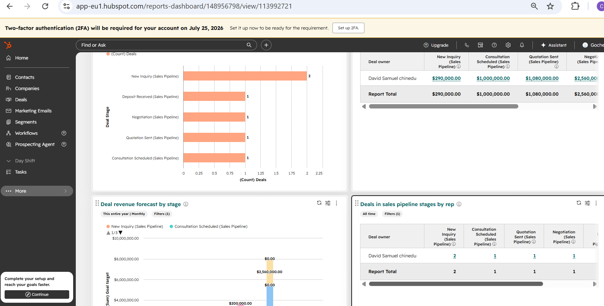
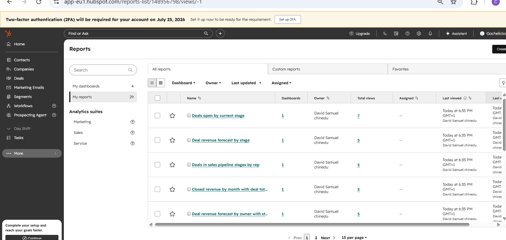
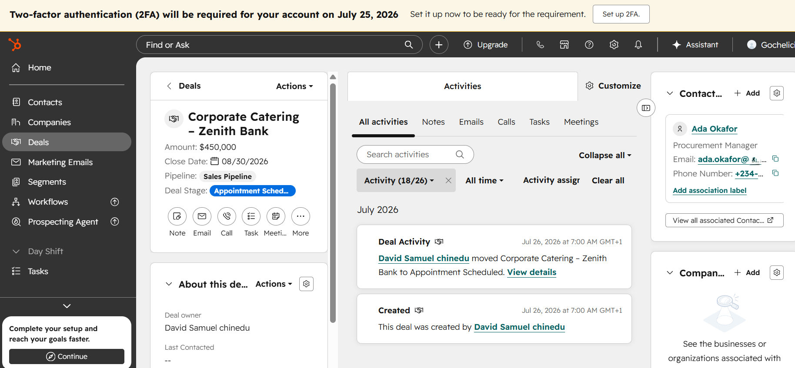
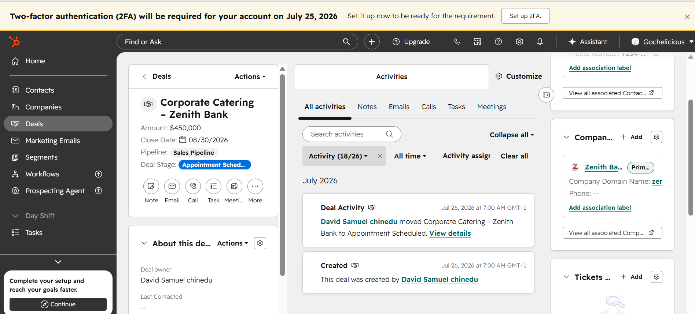
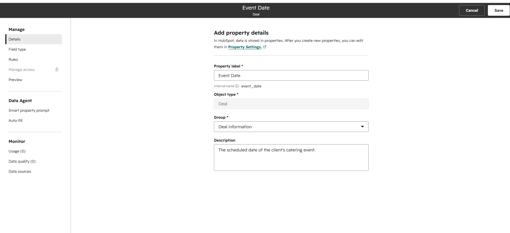
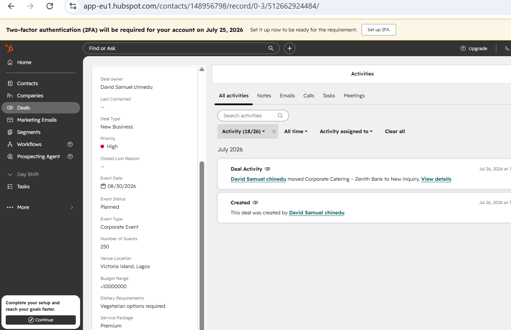
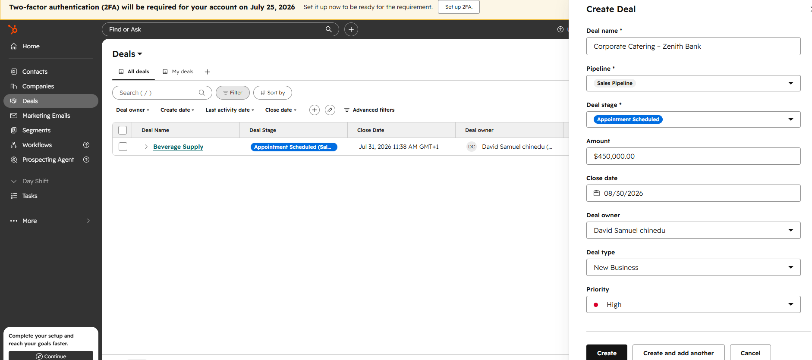
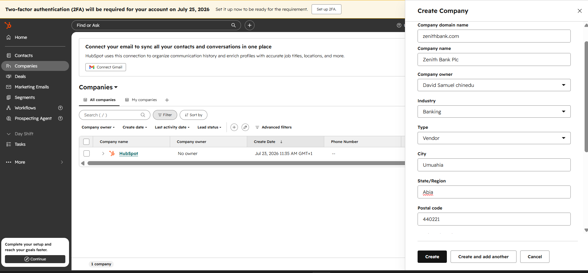
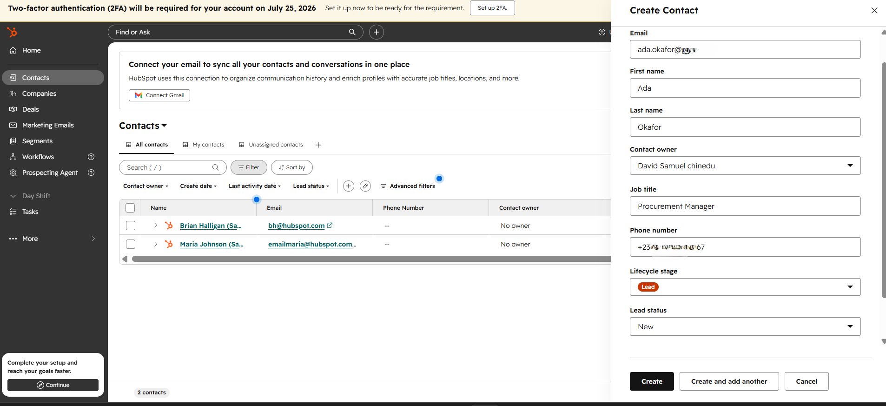

# Gochelicious HubSpot CRM Implementation

A practical CRM implementation project demonstrating business analysis, CRM configuration, sales process optimization, and customer relationship management using **HubSpot CRM** for a growing catering business.

---

## Project Overview

This project demonstrates the implementation of HubSpot CRM for **Gochelicious**, a catering business, to improve customer relationship management, streamline the sales process, and centralize business operations.

The implementation focused on configuring HubSpot's core CRM features, documenting business processes, designing reusable templates, and creating standardized workflows to support customer engagement from initial enquiry through post-event follow-up.

---

## Business Background

Gochelicious provides catering services for corporate events, private functions, and special occasions. As customer enquiries and bookings increased, managing customer information manually became inefficient.

HubSpot CRM was implemented to centralize customer records, standardize sales activities, improve reporting, and establish scalable business processes.

---

## Project Objectives

- Centralize customer and company information
- Configure a structured sales pipeline
- Create catering-specific custom properties
- Standardize customer communication
- Improve sales reporting
- Document CRM workflows
- Build a scalable CRM foundation

---

## Solution Overview

The implementation included:

- Contact Management
- Company Management
- Deal Management
- Sales Pipeline Configuration
- Custom Deal Properties
- Contact & Company Associations
- CRM Dashboard
- Custom Reports
- Email Templates
- Workflow Documentation

Although HubSpot Free does not support workflow automation, complete workflow documentation was produced to support future upgrades.

---

# Project Gallery

## Sales Performance & Reporting

The CRM dashboard and reporting tools provide visibility into the sales pipeline, deal progress, and overall business performance.

<table>
<tr>
<td align="center" width="50%">

### Sales Dashboard



</td>

<td align="center" width="50%">

### Custom Reports



</td>
</tr>
</table>

---

## Customer & Deal Management

HubSpot associations connect contacts, companies, and opportunities, giving the business a complete view of every customer's journey.

<table>
<tr>
<td align="center" width="50%">

### Deal & Contact Association



</td>

<td align="center" width="50%">

### Deal & Company Association



</td>
</tr>
</table>

---

## Custom CRM Configuration

Custom properties were configured to capture business-specific information required for event planning and operational reporting.

<table>
<tr>
<td align="center" width="50%">

### Event Date Property



</td>

<td align="center" width="50%">

### Custom Deal Properties



</td>
</tr>
</table>

---

## Creating CRM Records

The implementation supports consistent creation of contacts, companies, and sales opportunities to ensure complete customer records.

<table>
<tr>
<td align="center" width="33%">

### Deal



</td>

<td align="center" width="33%">

### Company



</td>

<td align="center" width="33%">

### Contact



</td>
</tr>
</table>

---

## Repository Structure

```text
hubspot-crm-business-implementation/

├── 01-documentation/
│   ├── Business Requirements
│   ├── CRM Configuration
│   ├── Sales Pipeline
│   ├── Custom Properties
│   ├── Dashboard Configuration
│   └── Reports
│
├── 02-screenshots/
│   └── CRM implementation screenshots
│
├── 03-templates/
│   ├── Initial Inquiry Template
│   ├── Follow-up Email
│   ├── Event Confirmation
│   ├── Deposit Reminder
│   ├── Consultation Meeting
│   └── Proposal Template
│
├── 04-workflows/
│   ├── Lead Qualification Workflow
│   ├── Deal Management Workflow
│   ├── Customer Onboarding Workflow
│   ├── Follow-up Workflow
│   └── Customer Success Workflow
│
└── README.md
```

---

## Project Walkthrough

The implementation followed a structured deployment process:

1. Gather business requirements.
2. Configure CRM records.
3. Design the sales pipeline.
4. Create custom properties.
5. Configure dashboards.
6. Build custom reports.
7. Develop reusable templates.
8. Document business workflows.
9. Capture implementation evidence through screenshots.

---

## Key Deliverables

- Business Requirements Documentation
- CRM Configuration Documentation
- Sales Pipeline Design
- Custom Deal Properties
- CRM Dashboard
- Business Reports
- Customer Communication Templates
- Workflow Documentation
- Implementation Screenshots

---

## Business Outcomes

The implementation provides:

- Centralized customer information
- Improved sales visibility
- Standardized business processes
- Better customer relationship management
- Improved reporting
- Consistent communication
- Scalable CRM documentation
- Foundation for future workflow automation

---

## Lessons Learned

- CRM implementations should begin with clearly defined business requirements.
- Well-designed custom properties improve reporting quality.
- Standardized sales processes improve user adoption.
- Documentation is as valuable as system configuration.
- Workflow planning simplifies future automation.

---

## Future Enhancements

Future improvements may include:

- Workflow Automation
- Email Automation
- Lead Scoring
- Customer Satisfaction Surveys
- Advanced Dashboards
- Task Automation
- Third-party Integrations

---

## Author

**Chika Blessing**

Operations • Customer Success • CRM • Project Management • Success Partner

---

*Same warmth, wherever you find me*
